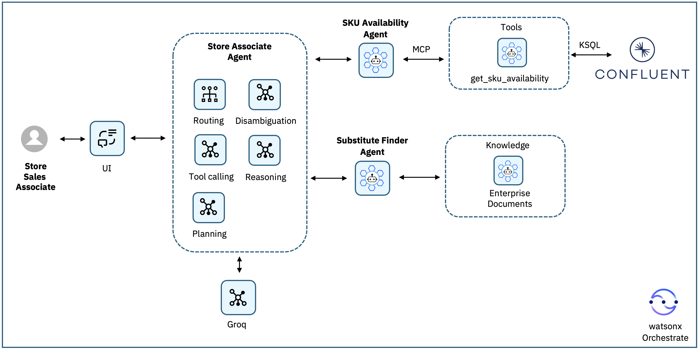

# アーキテクチャ概要

## システム全体の構成

このシステムは以下のコンポーネントで構成されています。

---

### Confluent Cloud（Kafka）

| トピック名 | 説明 |
|-----------|------|
| `inventory.transactions` | 在庫増加と販売（負の数量）の JSON トランザクションイベントを格納するソーストピック |
| `inventory.availability` | SKU・ブランチごとの現在の在庫数量を表す派生トピック |

### ksqlDB（ストリーム処理）

`inventory.transactions` を継続的に読み込み、SKU とブランチ（支店）で集計し、最新の在庫状況を `inventory.availability` に書き込みます。

### Kafka 在庫確認ツール（MCP ツールキット）

Kafka から算出した現在の在庫状況を照会するための `get_sku_availability(sku, branch)` ツールを提供します。

### watsonx Orchestrate エージェント

| エージェント名 | 役割 |
|--------------|------|
| **SKU_Availability_Agent** | 在庫確認ツールを呼び出して、指定したブランチ（支店）の在庫をチェックする |
| **Substitute_Finder_Agent** | 要求された SKU が在庫切れの場合、製品カタログドキュメントから類似 SKU を推薦する |
| **Store_Associate_Agent** | 上記2つの専門エージェントをルーティングし、顧客向けの回答をまとめるスーパーバイザーエージェント |

### 製品カタログドキュメント

製品カタログドキュメント（`product-catalog.docx`）をナレッジソース（`enterprise_documents`）としてアップロードし、Substitute Finder Agent でのセマンティック類似検索に使用します。

---

## アーキテクチャ図

---

## データフロー（詳細）

### ① 問い合わせの受付

店舗スタッフが UI を通じて在庫に関する質問を行います。

```
MallOfEgypt に LAPTOP-DELL-XPS-15 はありますか？
```

### ② スーパーバイザーエージェントによる解析

**Store Associate Agent** がリクエストを受け取り、SKU とブランチを抽出して、どの専門エージェントに委任するかを判断します。

### ③ 在庫確認

**Store Associate Agent** が在庫チェックを **SKU Availability Agent** に委任します。

### ④ MCP ツールによるリアルタイム照会

**SKU Availability Agent** が `get_sku_availability` MCP ツールを呼び出し、ksqlDB がリアルタイムの在庫トランザクションから算出した `inventory.availability` の状態を照会します。

### ⑤ 在庫チェック結果の返却

**SKU Availability Agent** が以下のいずれかの結果を返します：

- SKU が在庫あり（現在数量を含む）
- SKU は追跡されているが現在在庫切れ
- SKU が在庫データに登録されていない

### ⑥ 分岐処理

```
在庫あり → Store Associate Agent が直接応答（在庫数量を返す）
在庫なし → Substitute Finder Agent に代替品検索を委任
```

### ⑦ 代替品推薦

**Substitute Finder Agent** がエンタープライズ製品ドキュメントに対してセマンティック検索を行い、カテゴリ・フォームファクター・プロセッサークラス・使用目的などの製品属性に基づいて類似 SKU を特定します。

- 適切な代替製品を 2〜3 件返す
- 各代替品について推薦理由を短く説明する

### ⑧ 最終回答の生成

**Store Associate Agent** が各エージェントの結果をまとめ、顧客向けの回答としてユーザーに返します。

---

## 次のステップ

アーキテクチャを理解したら、[ステップ1](steps/step1.md) から実装を開始しましょう。
